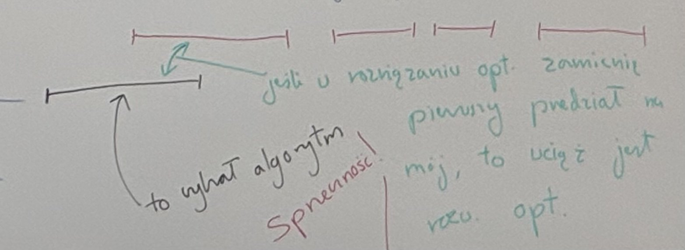

# Wykład 8 (06.05)

# Algorytmy zachłanne
***
- Algorytmy, które robią to co wydaje się najlepsze w danej chwili, 
nie patrząc na konsekwencje

## Problem wyboru zajęć
***
Dane: Zbiór przedziałów $[a_1, b_1], [a_2, b_2], ...$<br>
Zadanie: Wybrać jak najwięcej przedziałów rozłącznych 
**Algorytm**
- wybierz przedział kończący się najwcześniej
- usuń przecięcie z nim
- powtarzaj póki zostały przedziały 

**Dowód poprawności**<br>
- Rozważam kolejne kroki algorytmu (kolejne wybierane przedziały)
- Rozważam peirwszy moment kiedy algorytm wybrał przedział uniemożliwiający 
dokończenie rozwiązania w sposób optymmalny<br>


## Kody Huffmana
***

| Symbol   | Częstość | Kodowanie bazowe | Liczba bitów (Częstość × 3) |
|:---------|:--------:|:----------------:|:---------------------------:|
| **a**    |   500    |       000        |            1500             |
| **b**    |    5     |       001        |             15              |
| **c**    |    20    |       010        |             60              |
| **d**    |   300    |       011        |             900             |
| **e**    |   700    |       100        |            2100             |
| **f**    |    67    |       101        |             201             |
| **SUMA** | **1592** |        —         |          **4776**           |

**Kod prefiksowy**<br>
Słowa kodowe mogą być różnej długości, ale żaden kod nie może być prefiksem innego<br>
**Algorytm**<br>
Bierzemy dwa najżadsze symbole i sklejamy je.

**Dowód**<br>
Nigdy nie jest błędem skleić dwa najrzadsze symbole
T - drzewo kodów prefiksowych 
$B(T) =  \sum\limits_{s \in S} f(s) * d_t(s)$<br>
T - jakieś drzewo<br>
a, b - dwa symbole najdalej od korzenia<br>
x, y 0 dwa najrzadsze symbole<br>
$T'$ zamienia symbole x i a<br><br>
```math
B(T') = B(T) - f(a)*d_t(a) + f(a) * d_t(x) - f(x) * d_t(x) + f(x) * d_t(a)
```

```math
B(T') = B(T) - f(a)(d_t(x) - d_t(a)) - f(x)(d_t(x) - d_t(a)
```

```math
B(T') = B(T) + (d_t(x) - d_t(a))*(f(a) - f(x)) \le B(T)
```

```math
d_t(x) - d_t(a) \le 0 \newline
```

```math
f(a) - f(x) \ge 0
```
***
Optymalna podstruktura - po rozwiązaniu pierwszego kroku mamy
do rozwiązania taki sam rodzaj problemu, ale mniejszy

## Wieża z klocków
***
Mamy n wieży z klocków, chcemy zabierając klocki zbudowac największa wieże,
minimalizujac liczbe branych klocków<br>
Heurystyki:
1. Najwyższy klocek pierwszy
2. Najwyższy klocek z najwyższej wieży

**Algorytm**<br>
Łączymy dwa 1 i 2 rozwiązanie zachłanne.
Dla każdej wysokości wieży T robimy:
- Póki istnieja wieże o wysokości większej od T stosujemy algorytm drugi
- Następnie stosujemy algorytm pierwszy aż nasza wieża nie będzie największa

Dla, któregoś z T dostaniemy optymalne rozwiązanie
## Problem plecakowy
- istnieje algorytm dynamiczny
- mamy przedmioty 
  - wartość
  - waga
  - B - pojemność plecaka
  
Heurystyki
1. Bierzemy przedmiot o najwyższym współczynniku wartośc/waga
2. bierzemy przedmiot o największej wartości

Łączymy obie heurystyki i wybieramy lepszą opcje.
Takie rozwiązanie daje nam wynik maksymalnie dwukrotnie gorszy od optymalnego.
